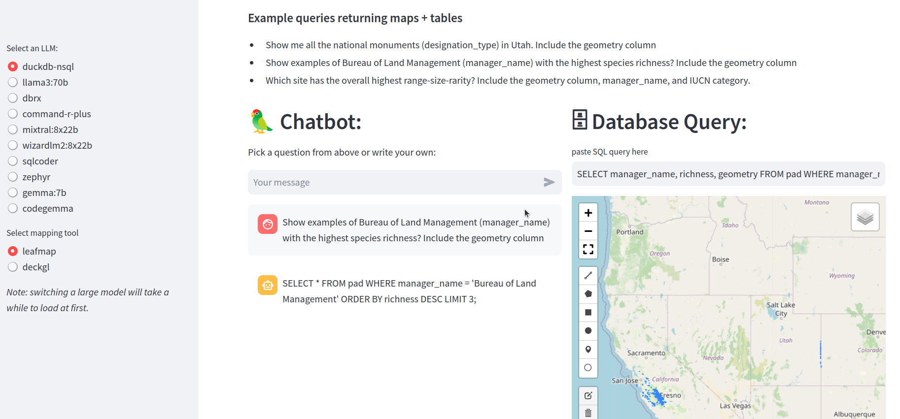

# sql-chatbots

Exploring SQL construction using free / open-weights LLMs

## Installation

Install python dependencies

```
pip install -r requirements.txt
```

- Install `ollama` , run `ollama serve`.  See <https://ollama.com/>
- Download your choice of models with `ollama`, e.g. 

```
ollama pull duckdb-nsql
ollama pull gemma
ollama pull zephyr
ollama pull sqlcoder
ollama pull codegemma
```

Larger models, requiring a GPU with greater onboard RAM:

```
ollama pull llama3:70b
ollama pull dbrx
ollama pull mixtral:8x22b
ollama pull wizardlm2:8x22b
ollama pull command-r-plus
```

(Choose whatever subset you like. `duckdb-nsql` works rather well and is small enough for many machines.)
Comment out models you don't want in the `app.py` st.radio selector.  


If you want to use OpenAI models, add the API key as a streamlit secret.  


## Database setup

provide a duckdb database file or alter the app.py to read directly from parquet etc.

## Run app

```bash
streamlit run app.py
```

